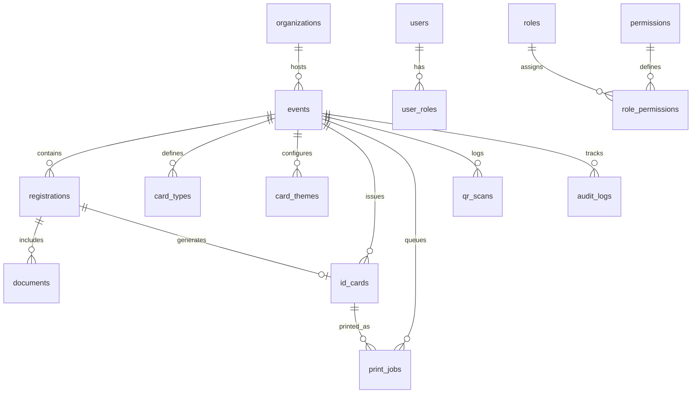

# Database Design & PostgreSQL Schema Specification

---

## 1. Relational Entity Overview

The system runs on **Supabase PostgreSQL 15+** configured with `UTF8` encoding and `en_US.UTF-8` collation for proper Gujarati script sorting and indexing.



---

## 2. Table Definitions & DDL Blueprint

### 2.1 Enums & Types
```sql
CREATE TYPE user_role_type AS ENUM (
  'SUPER_ADMIN',
  'EVENT_ADMIN',
  'VERIFIER',
  'DATA_ENTRY_OPERATOR',
  'SPECIAL_ID_OPERATOR',
  'PRINTER_OPERATOR',
  'SECURITY'
);

CREATE TYPE registration_status AS ENUM (
  'DRAFT',
  'SUBMITTED',
  'UNDER_VERIFICATION',
  'CORRECTION_REQUIRED',
  'REJECTED',
  'APPROVED'
);

CREATE TYPE document_type AS ENUM (
  'APPLICATION_FORM',
  'IDENTITY_PROOF',
  'PHOTOGRAPH',
  'OTHER'
);

CREATE TYPE verification_status AS ENUM (
  'PENDING',
  'VERIFIED',
  'REJECTED',
  'CORRECTION_REQUIRED'
);

CREATE TYPE card_status AS ENUM (
  'DRAFT',
  'PENDING_APPROVAL',
  'APPROVED',
  'PRINT_QUEUED',
  'PRINTED',
  'REPRINTED',
  'CANCELLED',
  'EXPIRED'
);

CREATE TYPE print_job_status AS ENUM (
  'QUEUED',
  'PRINTING',
  'PRINTED',
  'FAILED',
  'CANCELLED'
);

CREATE TYPE reprint_reason_type AS ENUM (
  'LOST',
  'DAMAGED',
  'WRONG_PRINT',
  'PRINTER_FAILURE',
  'PHOTO_REPLACEMENT',
  'OTHER'
);
```

### 2.2 Organizations & Events
```sql
CREATE TABLE organizations (
  id UUID PRIMARY KEY DEFAULT gen_random_uuid(),
  name_en TEXT NOT NULL,
  name_gu TEXT NOT NULL,
  code VARCHAR(50) UNIQUE NOT NULL,
  logo_url TEXT,
  created_at TIMESTAMPTZ NOT NULL DEFAULT now(),
  updated_at TIMESTAMPTZ NOT NULL DEFAULT now()
);

CREATE TABLE events (
  id UUID PRIMARY KEY DEFAULT gen_random_uuid(),
  organization_id UUID NOT NULL REFERENCES organizations(id) ON DELETE CASCADE,
  name_en TEXT NOT NULL,
  name_gu TEXT NOT NULL,
  code VARCHAR(50) NOT NULL,
  start_date DATE NOT NULL,
  end_date DATE NOT NULL,
  is_active BOOLEAN NOT NULL DEFAULT true,
  settings JSONB DEFAULT '{}'::jsonb,
  created_at TIMESTAMPTZ NOT NULL DEFAULT now(),
  updated_at TIMESTAMPTZ NOT NULL DEFAULT now(),
  UNIQUE(organization_id, code)
);
```

### 2.3 User Profiles, Roles & Permissions
```sql
CREATE TABLE user_profiles (
  id UUID PRIMARY KEY REFERENCES auth.users(id) ON DELETE CASCADE,
  full_name_en TEXT NOT NULL,
  full_name_gu TEXT,
  mobile VARCHAR(15) UNIQUE NOT NULL,
  is_active BOOLEAN NOT NULL DEFAULT true,
  created_at TIMESTAMPTZ NOT NULL DEFAULT now(),
  updated_at TIMESTAMPTZ NOT NULL DEFAULT now()
);

CREATE TABLE permissions (
  id UUID PRIMARY KEY DEFAULT gen_random_uuid(),
  code VARCHAR(100) UNIQUE NOT NULL,
  name TEXT NOT NULL,
  category VARCHAR(50) NOT NULL,
  description TEXT
);

CREATE TABLE roles (
  id UUID PRIMARY KEY DEFAULT gen_random_uuid(),
  code VARCHAR(50) UNIQUE NOT NULL,
  name TEXT NOT NULL,
  description TEXT,
  is_system BOOLEAN NOT NULL DEFAULT false
);

CREATE TABLE role_permissions (
  role_id UUID NOT NULL REFERENCES roles(id) ON DELETE CASCADE,
  permission_id UUID NOT NULL REFERENCES permissions(id) ON DELETE CASCADE,
  PRIMARY KEY (role_id, permission_id)
);

CREATE TABLE user_roles (
  id UUID PRIMARY KEY DEFAULT gen_random_uuid(),
  user_id UUID NOT NULL REFERENCES user_profiles(id) ON DELETE CASCADE,
  role_id UUID NOT NULL REFERENCES roles(id) ON DELETE CASCADE,
  event_id UUID REFERENCES events(id) ON DELETE CASCADE,
  created_at TIMESTAMPTZ NOT NULL DEFAULT now(),
  UNIQUE(user_id, role_id, event_id)
);
```

### 2.4 Registrations & Uploaded Documents
```sql
CREATE TABLE registrations (
  id UUID PRIMARY KEY DEFAULT gen_random_uuid(),
  event_id UUID NOT NULL REFERENCES events(id) ON DELETE CASCADE,
  registration_number VARCHAR(50) NOT NULL,
  full_name_en TEXT NOT NULL,
  full_name_gu TEXT NOT NULL,
  father_husband_name_en TEXT,
  father_husband_name_gu TEXT,
  gender VARCHAR(10) NOT NULL, -- 'MALE', 'FEMALE', 'OTHER'
  dob DATE,
  mobile VARCHAR(15) NOT NULL,
  alternate_mobile VARCHAR(15),
  address_en TEXT NOT NULL,
  address_gu TEXT NOT NULL,
  area_zone TEXT,
  city TEXT DEFAULT 'Vasad',
  state TEXT DEFAULT 'Gujarat',
  pincode VARCHAR(10),
  status registration_status NOT NULL DEFAULT 'DRAFT',
  category_id UUID NOT NULL, -- references card_types(id)
  created_by UUID REFERENCES user_profiles(id),
  verified_by UUID REFERENCES user_profiles(id),
  verified_at TIMESTAMPTZ,
  verification_remarks TEXT,
  created_at TIMESTAMPTZ NOT NULL DEFAULT now(),
  updated_at TIMESTAMPTZ NOT NULL DEFAULT now(),
  UNIQUE(event_id, registration_number)
);

CREATE INDEX idx_registrations_mobile ON registrations(event_id, mobile);
CREATE INDEX idx_registrations_status ON registrations(event_id, status);

CREATE TABLE documents (
  id UUID PRIMARY KEY DEFAULT gen_random_uuid(),
  registration_id UUID NOT NULL REFERENCES registrations(id) ON DELETE CASCADE,
  event_id UUID NOT NULL REFERENCES events(id) ON DELETE CASCADE,
  doc_type document_type NOT NULL,
  file_path TEXT NOT NULL, -- Supabase Storage private path
  original_filename TEXT NOT NULL,
  mime_type VARCHAR(100) NOT NULL,
  file_size_bytes INTEGER NOT NULL,
  status verification_status NOT NULL DEFAULT 'PENDING',
  remarks TEXT,
  uploaded_by UUID REFERENCES user_profiles(id),
  verified_by UUID REFERENCES user_profiles(id),
  verified_at TIMESTAMPTZ,
  created_at TIMESTAMPTZ NOT NULL DEFAULT now()
);
```

### 2.5 Card Categories, Themes & ID Cards
```sql
CREATE TABLE card_types (
  id UUID PRIMARY KEY DEFAULT gen_random_uuid(),
  event_id UUID NOT NULL REFERENCES events(id) ON DELETE CASCADE,
  code VARCHAR(50) NOT NULL,
  name_en TEXT NOT NULL,
  name_gu TEXT NOT NULL,
  is_registered BOOLEAN NOT NULL DEFAULT true, -- true for participants, false for VIP/Staff
  requires_approval BOOLEAN NOT NULL DEFAULT true,
  created_at TIMESTAMPTZ NOT NULL DEFAULT now(),
  UNIQUE(event_id, code)
);

CREATE TABLE card_themes (
  id UUID PRIMARY KEY DEFAULT gen_random_uuid(),
  event_id UUID NOT NULL REFERENCES events(id) ON DELETE CASCADE,
  card_type_id UUID NOT NULL REFERENCES card_types(id) ON DELETE CASCADE,
  gender_rule VARCHAR(10), -- 'MALE', 'FEMALE', or NULL for all
  primary_color VARCHAR(20) NOT NULL DEFAULT '#1E40AF',
  header_color VARCHAR(20) NOT NULL DEFAULT '#1E3A8A',
  footer_color VARCHAR(20) NOT NULL DEFAULT '#1E3A8A',
  accent_color VARCHAR(20) NOT NULL DEFAULT '#F59E0B',
  text_color VARCHAR(20) NOT NULL DEFAULT '#FFFFFF',
  logo_url TEXT,
  watermark_url TEXT,
  template_config JSONB DEFAULT '{}'::jsonb,
  created_at TIMESTAMPTZ NOT NULL DEFAULT now(),
  updated_at TIMESTAMPTZ NOT NULL DEFAULT now(),
  UNIQUE(event_id, card_type_id, gender_rule)
);

CREATE TABLE id_cards (
  id UUID PRIMARY KEY DEFAULT gen_random_uuid(),
  event_id UUID NOT NULL REFERENCES events(id) ON DELETE CASCADE,
  registration_id UUID REFERENCES registrations(id) ON DELETE SET NULL, -- NULL for special cards
  card_number VARCHAR(50) NOT NULL,
  qr_token VARCHAR(100) UNIQUE NOT NULL,
  card_type_id UUID NOT NULL REFERENCES card_types(id),
  theme_id UUID NOT NULL REFERENCES card_themes(id),
  holder_name_en TEXT NOT NULL,
  holder_name_gu TEXT NOT NULL,
  holder_photo_url TEXT,
  gender VARCHAR(10),
  valid_from DATE NOT NULL,
  valid_to DATE NOT NULL,
  status card_status NOT NULL DEFAULT 'APPROVED',
  print_count INTEGER NOT NULL DEFAULT 0,
  reprint_count INTEGER NOT NULL DEFAULT 0,
  created_by UUID REFERENCES user_profiles(id),
  approved_by UUID REFERENCES user_profiles(id),
  created_at TIMESTAMPTZ NOT NULL DEFAULT now(),
  updated_at TIMESTAMPTZ NOT NULL DEFAULT now(),
  UNIQUE(event_id, card_number)
);

CREATE INDEX idx_id_cards_qr_token ON id_cards(qr_token);
```

### 2.6 Print Queue, Scans & Audit Trails
```sql
CREATE TABLE print_jobs (
  id UUID PRIMARY KEY DEFAULT gen_random_uuid(),
  card_id UUID NOT NULL REFERENCES id_cards(id) ON DELETE CASCADE,
  event_id UUID NOT NULL REFERENCES events(id) ON DELETE CASCADE,
  printer_identifier VARCHAR(100),
  status print_job_status NOT NULL DEFAULT 'QUEUED',
  attempt_count INTEGER NOT NULL DEFAULT 0,
  error_message TEXT,
  reprint_flag BOOLEAN NOT NULL DEFAULT false,
  reprint_reason reprint_reason_type,
  reprint_notes TEXT,
  requested_by UUID REFERENCES user_profiles(id),
  printed_at TIMESTAMPTZ,
  created_at TIMESTAMPTZ NOT NULL DEFAULT now()
);

CREATE TABLE qr_scans (
  id UUID PRIMARY KEY DEFAULT gen_random_uuid(),
  event_id UUID NOT NULL REFERENCES events(id) ON DELETE CASCADE,
  qr_token VARCHAR(100) NOT NULL,
  card_id UUID REFERENCES id_cards(id),
  scanned_by UUID REFERENCES user_profiles(id),
  scanned_at TIMESTAMPTZ NOT NULL DEFAULT now(),
  result_status VARCHAR(50) NOT NULL, -- 'VALID', 'EXPIRED', 'CANCELLED', 'NOT_FOUND'
  gate_location VARCHAR(100),
  device_info TEXT
);

CREATE TABLE audit_logs (
  id UUID PRIMARY KEY DEFAULT gen_random_uuid(),
  event_id UUID REFERENCES events(id) ON DELETE SET NULL,
  user_id UUID REFERENCES user_profiles(id) ON DELETE SET NULL,
  action VARCHAR(100) NOT NULL,
  entity_type VARCHAR(50) NOT NULL,
  entity_id UUID,
  details JSONB DEFAULT '{}'::jsonb,
  ip_address VARCHAR(50),
  user_agent TEXT,
  created_at TIMESTAMPTZ NOT NULL DEFAULT now()
);
```

---

## 3. Row-Level Security (RLS) & Storage Access Policies

1. **`registrations` table**:
   - `SELECT`: Allowed if user has `VIEW_REGISTRATION` for the corresponding `event_id`.
   - `INSERT`: Allowed if user has `CREATE_REGISTRATION`.
   - `UPDATE`: Allowed if user has `EDIT_REGISTRATION` (drafts/resubmissions) or `APPROVE_REGISTRATION` / `REJECT_REGISTRATION` (verifiers).
2. **`documents` table**:
   - `SELECT`: Allowed strictly for verifiers and administrators with `VIEW_DOCUMENT`.
   - Ephemeral signed URLs generated with service role key, capped at 300 seconds.
3. **`audit_logs` table**:
   - `INSERT`: Allowed via database trigger or system service role.
   - `UPDATE` / `DELETE`: Strictly revoked from all users (append-only ledger).
