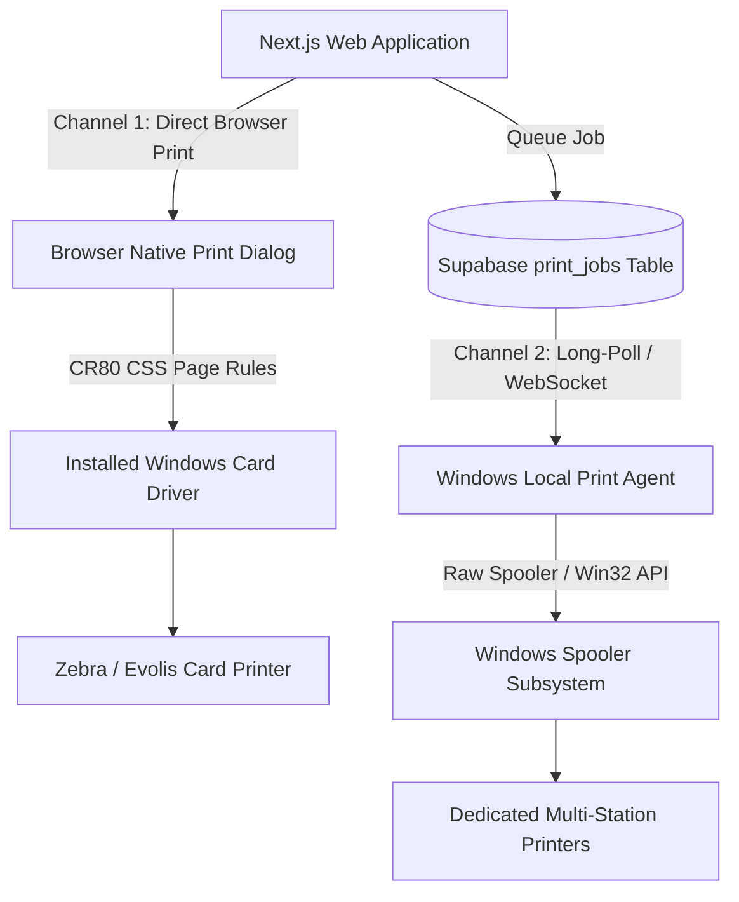
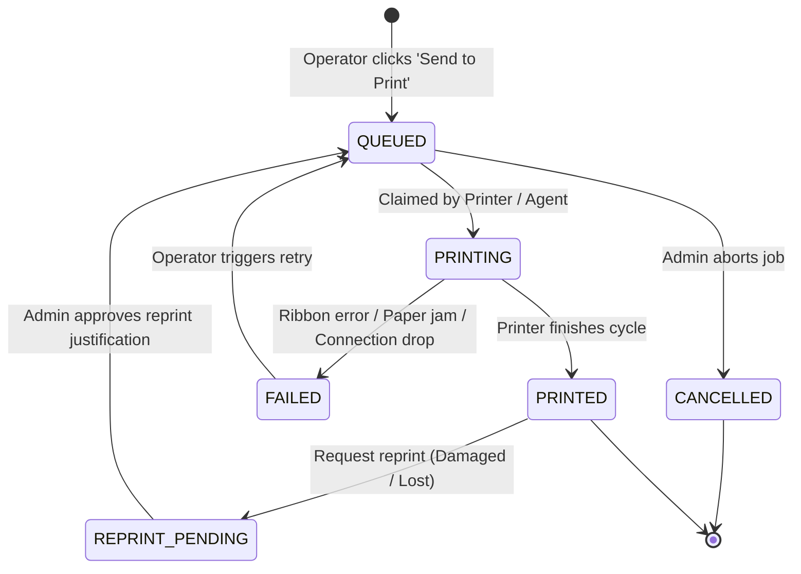

# Printing Architecture & Multi-Printer Integration

---

## 1. Architectural Strategy

Physical ID card printing must support two complementary channels:



1. **Channel 1 — Direct Browser Print (Zero Setup)**:
   - Modern Chromium/Edge browsers allow CSS `@page` declarations with exact physical millimeter sizing.
   - Ideal for immediate, single-card issuance from any operator PC.
2. **Channel 2 — Dedicated Background Print Agent (High-Volume Batch Production)**:
   - A lightweight Node.js/Go background daemon installed on the printer host PC.
   - Long-polls or listens via Supabase Realtime to the `print_jobs` table.
   - Renders the card canvas at 300 DPI, downloads the bitmap, and sends it directly to the designated Windows print spooler queue using the printer SDK or raw driver command.

---

## 2. Direct Browser Web-to-Print CSS Specification

```css
/* Print Media Stylesheet for CR80 Cards */
@media print {
  @page {
    size: 85.60mm 53.98mm; /* ISO CR80 standard */
    margin: 0mm;           /* Edge-to-edge dye-sublimation print */
  }

  html, body {
    margin: 0;
    padding: 0;
    width: 85.60mm;
    height: 53.98mm;
    background: transparent;
    -webkit-print-color-adjust: exact !important;
    print-color-adjust: exact !important;
  }

  .no-print {
    display: none !important;
  }

  .id-card-print-container {
    width: 85.60mm;
    height: 53.98mm;
    page-break-after: always;
    overflow: hidden;
    position: relative;
    box-sizing: border-box;
  }

  /* Dual-sided continuous feed */
  .id-card-front {
    page-break-after: always;
  }

  .id-card-back {
    page-break-after: avoid;
  }
}
```

---

## 3. Print Job Lifecycle & State Machine



---

## 4. Printer Hardware Compatibility Checklist

Before deploying on-site for the event, operators execute the following verification against installed card printers:

- [ ] **Printer Make & Model**: (e.g., Zebra ZC300, Evolis Primacy, Magicard 300, Fargo HDP5000).
- [ ] **Driver Version**: Official manufacturer Windows 64-bit WHQL certified driver.
- [ ] **Interface**: USB 2.0 / USB 3.0 or Static IP Ethernet.
- [ ] **Color Ribbon**: YMCKO (Color front, Black resin + Overlay back) or YMCKOK.
- [ ] **Edge-to-Edge Capability**: Over-the-edge retransfer vs. direct-to-card dye-sublimation.
- [ ] **Card Stock**: Standard PVC 30 mil (0.76 mm) CR80.
