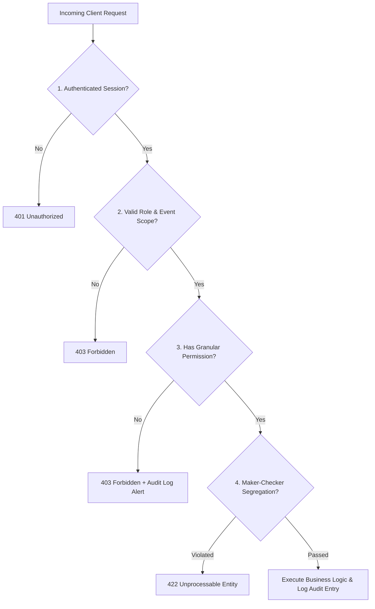

# Security, Data Protection & Identity Privacy Policy

---

## 1. Threat Model & Security Posture

The system manages government identity documents, Aadhaar cards, and physical access credentials for large public gatherings. Security breaches risk identity theft, ticket duplication, and unauthorized VIP/security zone ingress.

---

## 2. Sensitive Identity Document Protection (Aadhaar / Voter ID)

### 2.1 Storage Isolation
- Identity proof documents are stored in a **Private Supabase Storage Bucket** (`event-identity-documents`).
- The bucket strictly forbids public read access (`public = false`).
- Row-Level Security (RLS) policies restrict bucket read operations exclusively to server-side service keys and verifiers with explicit `VIEW_DOCUMENT` permission.

### 2.2 Short-Lived Ephemeral Signed URLs
- Proof images are never transmitted via static URLs.
- When an authorized verifier inspects a record, the server creates a time-limited signed URL:
  ```typescript
  const { data, error } = await supabaseAdmin.storage
    .from('event-identity-documents')
    .createSignedUrl(documentPath, 300); // Exactly 5 minutes validity
  ```
- URL expires automatically; links cannot be leaked or shared externally.

### 2.3 Aadhaar Data Minimization & Masking
- **Never Store Full Aadhaar Numbers**: If Aadhaar is used as identity proof, only the last 4 digits (`XXXX-XXXX-1234`) are permitted in database fields.
- **QR Code Exclusion**: Aadhaar numbers are prohibited from QR code payloads and physical card surfaces.
- **Retention & Purge Policy**: Upon conclusion of the event (and audit reconciliation), physical proof scans can be scheduled for batch cryptographic shredding.

---

## 3. Server-Side Authorization Boundary

Client-side UI conditionals (e.g., hiding action buttons) are strictly cosmetic. Every mutation in Next.js Server Actions and Route Handlers implements the three-tier defense:



---

## 4. File Upload Security Checklist

1. **MIME Type Validation**: Verify against whitelist (`image/jpeg`, `image/png`, `application/pdf`).
2. **Magic Number Inspection**: Inspect initial binary bytes to prevent disguised executable uploads (`.exe`, `.bat`, `.sh` renamed as `.jpg`).
3. **File Size Hard Limits**:
   - Photos: Maximum 2.0 MB.
   - Document Proofs & Forms: Maximum 5.0 MB.
4. **Filename Sanitization**: Strip original filenames; store under UUID hashes (`${event_id}/${doc_type}_${crypto.randomUUID()}.${ext}`).

---

## 5. Audit Logging Architecture

Every state mutation and sensitive inspection triggers an immutable row insertion into `audit_logs`:
- **Captured Metadata**:
  - `user_id`: Authenticated user UUID.
  - `action`: Specific operation code (e.g., `APPROVE_REGISTRATION`, `VIEW_AADHAAR_PROOF`, `REPRINT_CARD`).
  - `entity_type` & `entity_id`: Target record.
  - `details`: JSONB snapshot of state changes or reprint reasons.
  - `ip_address` & `user_agent`: Network origin.
  - `timestamp`: UTC timestamp.
- Table permissions: `UPDATE` and `DELETE` SQL grants are revoked from all database roles to guarantee tamper resistance.
