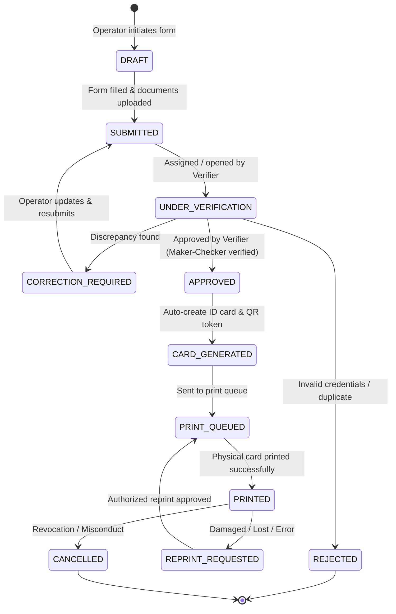
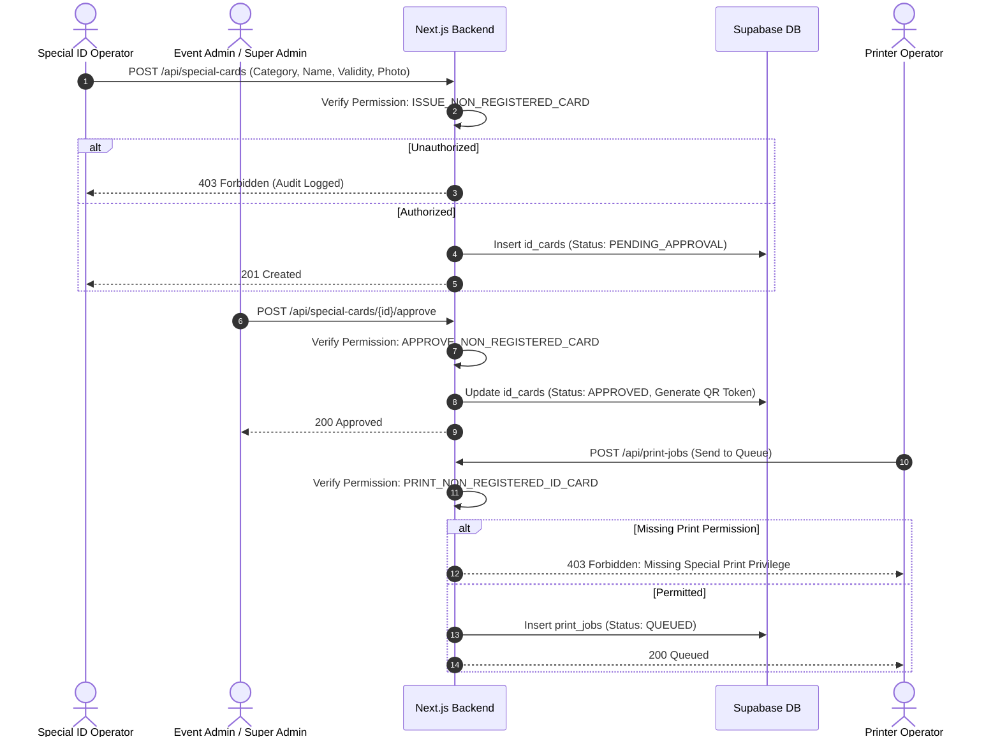
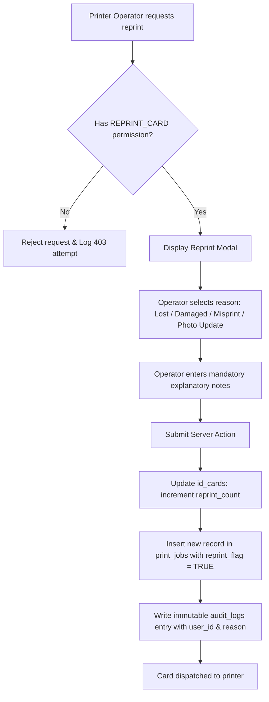
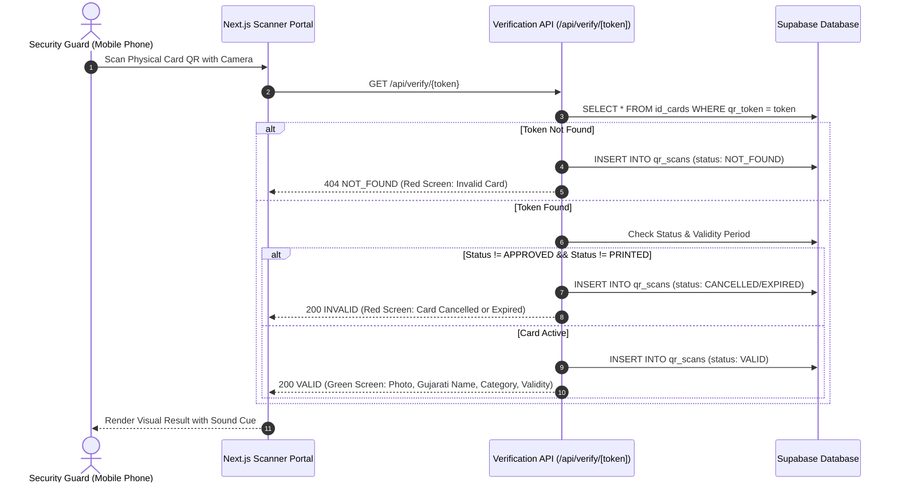

# Operational Workflows & State Machine Specifications

---

## 1. Participant Registration Lifecycle

The registration process governs the complete progression of a standard participant from initial form filling to physical card issuance.

### State Definitions:
- `DRAFT`: Form partially filled; editable only by the authoring Data Entry Operator.
- `SUBMITTED`: Form finalized, mandatory proofs uploaded, awaiting verifier review.
- `UNDER_VERIFICATION`: Verifier has locked the record for inspection.
- `CORRECTION_REQUIRED`: Returned to data entry with detailed verifier notes.
- `REJECTED`: Permanently rejected with an immutable reason logged.
- `APPROVED`: Passed all verification checks; eligible for card generation.
- `PRINTED`: Card has been physically output on an ID card printer.
- `CANCELLED`: Card revoked; subsequent QR scans report `INVALID/CANCELLED`.

---

## 2. Non-Registered & Special Access Card Workflow

Special access cards (VIP, Guest, Security, Volunteer, Staff, Media) bypass the general registration queue and follow a strictly audited, privileged lifecycle.

---

## 3. Controlled Reprint Workflow

Reprinting is a high-risk operational action prone to credential duplication and fraud. It enforces strict audit compliance.

---

## 4. Mobile QR Verification Flow

